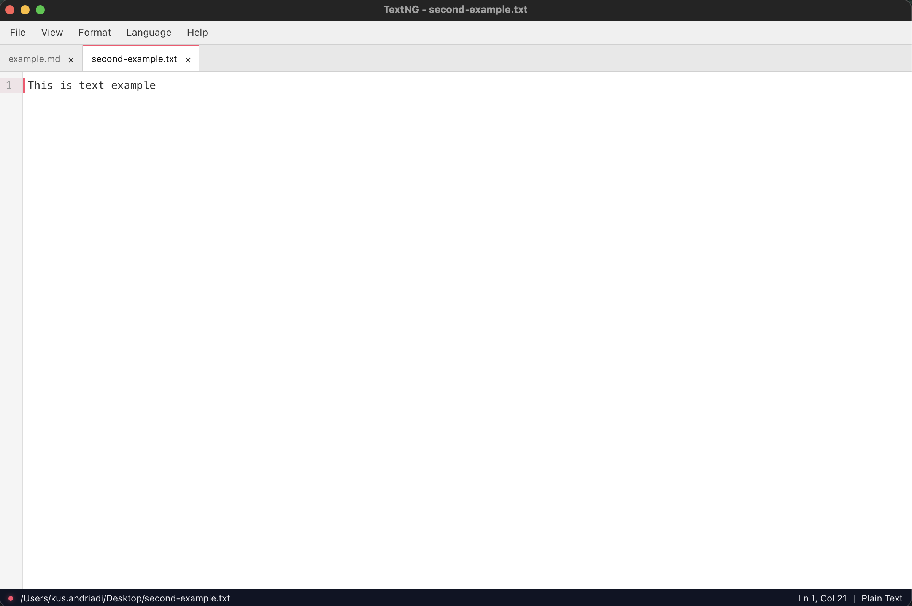
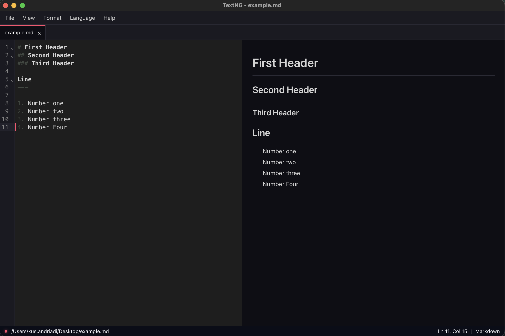

# TextNG

A lightweight, fast code editor for macOS.





## Why TextNG?

Most code editors are either too heavy (VS Code, Sublime Text) or too basic (TextEdit).

TextNG fills that gap. It's a native macOS app that launches instantly, supports syntax highlighting for 15+ languages, and stays out of your way. No extensions to install, no configuration files to manage — just open it and start editing.

## Features

- Syntax highlighting for 15+ programming languages
- Code formatting with Prettier (JavaScript, TypeScript, HTML, CSS, JSON, Markdown)
- Markdown live preview with split view
- Multi-tab editing
- Session persistence — unsaved work survives app restarts
- Light and Dark themes (follows system preference)
- Word wrap toggle
- Native macOS keyboard shortcuts

## Installation

### Homebrew (Recommended)

```bash
brew tap kusandriadi/tap
brew install --no-quarantine --cask textng
```

To update:

```bash
brew upgrade --no-quarantine --cask textng
```

> `--no-quarantine` is needed because the app is not signed with an Apple Developer certificate.

### Download DMG

1. Go to the [Releases](https://github.com/kusandriadi/textng/releases) page
2. Download `TextNG.dmg`
3. Open the DMG and drag **TextNG** to **Applications**

> **Note:** On first launch, macOS may show a security warning. To open: right-click the app > Open > Open.

### Build from source

```bash
# Prerequisites: Bun (v1.0+) and Rust (v1.77+)
git clone https://github.com/kusandriadi/textng.git
cd textng
bun install
bunx tauri build
```

## System Requirements

**macOS only**

| macOS Version | Supported |
|---|---|
| macOS 15 Sequoia | Yes |
| macOS 14 Sonoma | Yes |
| macOS 13 Ventura | Yes |
| macOS 12 Monterey | Yes |
| macOS 11 Big Sur | Yes |
| macOS 10.15 Catalina | Yes |
| macOS 10.14 Mojave and below | No |

Architecture: Apple Silicon (arm64) only

## Supported Languages

JavaScript, TypeScript, JSX, TSX, HTML, CSS, JSON, Python, Java, C, C++, Rust, PHP, SQL, XML, Markdown

## Development

```bash
# Run in development mode (hot reload)
bunx tauri dev

# Run tests
bun run test

# Build for production
bunx tauri build
```

## Tech Stack

- [Tauri v2](https://v2.tauri.app/) — Native macOS app shell (uses system WebView, no Chromium)
- [Svelte 5](https://svelte.dev/) + TypeScript — UI framework
- [Tailwind CSS 4](https://tailwindcss.com/) — Styling
- [CodeMirror 6](https://codemirror.net/) — Code editor engine
- [Prettier](https://prettier.io/) — Code formatter
- [Marked](https://marked.js.org/) + [DOMPurify](https://github.com/cure53/DOMPurify) — Markdown rendering (sanitized)

## Author

**Kus Andriadi** — [github.com/kusandriadi](https://github.com/kusandriadi)

## License

MIT
